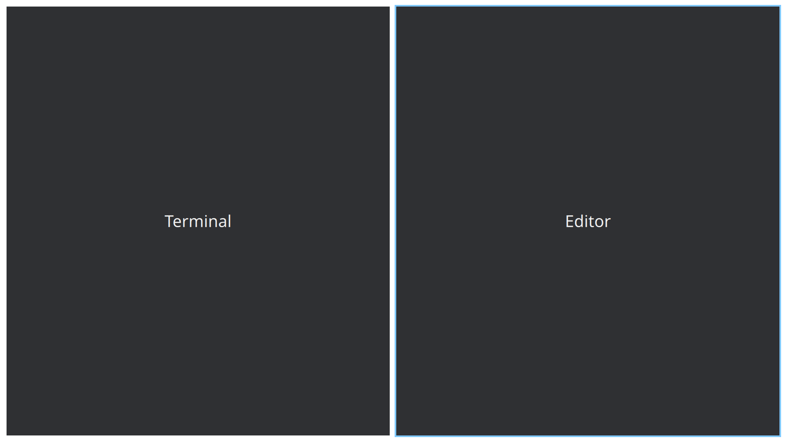

# Konveyor

Scrollable tiling for KDE Plasma. Your windows live in one endless row you scroll through, instead of being stacked on top of each other — and the rest of your Plasma desktop stays exactly as it is.



## Quickstart

```sh
git clone https://github.com/DevL0rd/Linux-Konveyor.git
cd Linux-Konveyor
./install.sh
```

Log out and back in. Press **Super+K** at any time to see every shortcut.

Run `./install.sh` again whenever you want to update — it is safe to repeat and keeps your settings. To remove everything, run `./uninstall.sh`.

Requires KDE Plasma 6.4 or newer on Wayland.

## What it does

**Windows never overlap and never get lost.** Opening a window puts it in a column next to the current one. Nothing is covered up, nothing jumps around, and the window you were using stays where it was.

**The desktop is wider than your screen.** When a row runs past the edge of the monitor, it scrolls. Move to the next window and the view follows it, so an ultrawide shows four windows at once and a laptop shows two — from the same row.

**You decide how wide a window is.** One key cycles a window through a third, half and two thirds of the screen. Another expands it into whatever space is free. Windows can also be stacked in one column, or turned into tabs that share a slot in the row.

**Every window is a keystroke away.** Move focus by direction, jump to the first or last window, or to column 1–9. Send the focused window anywhere the same way. Workspaces stack vertically and are created and cleaned up as you use them.

**Anything that does not belong in a row can float.** Super+Space lifts a window out of the tiling; press it again to drop it back. Dialogs and pop-ups float on their own.

**It is smooth.** Scrolling, resizing, opening, closing and workspace changes are all animated with configurable springs and easing curves, and drawn by the compositor rather than faked on top of it.

**The active window is outlined in your accent color.** Change your Plasma accent and the outline follows.

**Your Plasma stays your Plasma.** Panels, widgets, the overview, KRunner, screenshots, notifications, the lock screen, Alt+F4 and Alt+Tab all keep working and keep their shortcuts. Konveyor only takes over where windows go.

## Configuration

Everything lives in `~/.config/konveyor/config.kdl`, a [KDL](https://kdl.dev) file. The shipped default config lists every option with a short explanation. Save the file and the change is live — no restart, no logout.

```kdl
layout {
    gaps 16
    center-focused-column "never"
    default-column-width { proportion 0.5; }

    focus-ring {
        width 4
        active-color "accent"
    }
}

binds {
    Mod+Left  { focus-column-left; }
    Mod+Right { focus-column-right; }
    Mod+R     { switch-preset-column-width; }
}
```

You get gaps, borders, a focus ring, shadows, tab indicators, preset widths, centering modes, per-monitor and per-workspace overrides, window rules, animation springs and key binds. Two KDE-specific extras: `active-color "accent"` follows the KDE accent color, and `gestures { titlebar-drag "scroll-view" }` scrolls the row when you drag a window by its title bar.

If a config file has a mistake, Konveyor keeps running with the last good one and tells you what is wrong.

## Shortcuts

Press **Super+K** for a searchable list of every shortcut, built from your own config. The defaults leave alone anything KDE already uses:

| Key | Action |
| --- | --- |
| Super+← → | Focus the column left or right |
| Super+↑ ↓ | Focus within a column, then the workspace above or below |
| Super+Ctrl+← → | Move the column |
| Super+Ctrl+↑ ↓ | Move the window within its column, then to the workspace above or below |
| Super+R | Cycle the column width |
| Super+F | Cycle full width, fill the screen edges, normal |
| Super+Return | Open Konsole |
| Super+Q | Close the window |
| Super+Space | Float or unfloat |
| Super+Page Up / Down | Switch workspace |
| Super+1…9 | Go to workspace 1–9 |
| Super+Scroll | Switch workspace |
| Super+O | Overview |

## Scripting

`konveyor msg` queries and controls the running instance:

```sh
konveyor msg windows
konveyor msg action set-column-width +10%
```

## Credits

Konveyor is inspired by [niri](https://github.com/niri-wm/niri). It is an independent project and is not affiliated with it or with KDE.

Licensed under the GPL-3.0-or-later.
