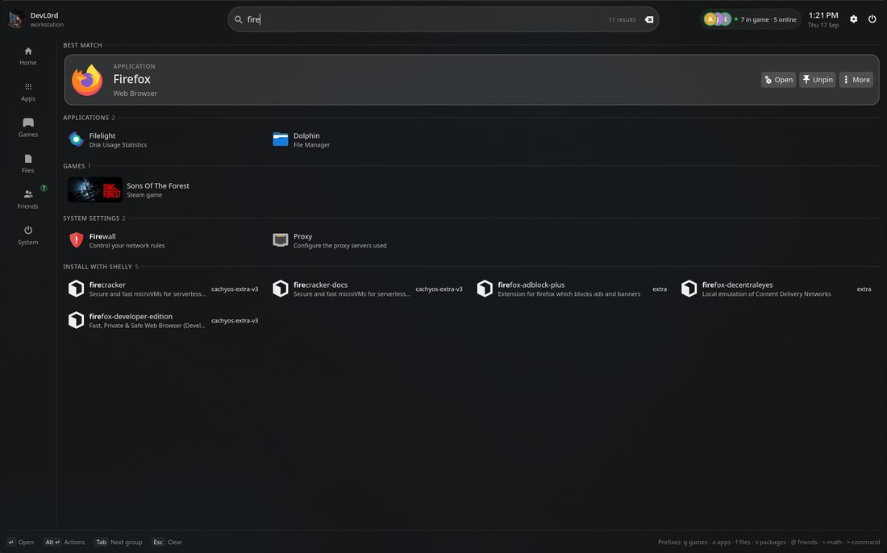
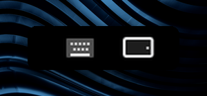

<a id="top"></a>

<p align="center">
  <picture>
    <source media="(prefers-color-scheme: dark)" srcset="docs/media/banner-dark.svg">
    <source media="(prefers-color-scheme: light)" srcset="docs/media/banner-light.svg">
    
  </picture>
</p>

<p align="center">
  <a href="https://github.com/DevL0rd/Konveyor/actions/workflows/ci.yml"></a>
  
  
  <a href="LICENSE"></a>
  <a href="https://github.com/DevL0rd/Konveyor/stargazers"></a>
</p>

<h3 align="center">Your windows, on a conveyor belt.</h3>

<p align="center">
  Konveyor turns Plasma into an endless, scrollable row of windows.<br>
  Nothing overlaps, nothing gets buried, and the rest of your desktop stays exactly the way you like it.
</p>

<p align="center">
  <a href="#get-started"><b>Get started</b></a> ·
  <a href="#see-it-move"><b>See it move</b></a> ·
  <a href="#widgets"><b>Konveyor widgets</b></a> ·
  <a href="#settings"><b>Settings</b></a> ·
  <a href="#shortcuts"><b>Shortcuts</b></a> ·
  <a href="#faq"><b>FAQ</b></a>
</p>

<p align="center">
  
</p>

---

<a id="get-started"></a>

## 🚀 Get started

```sh
git clone https://github.com/DevL0rd/Konveyor.git
cd Konveyor
./install.sh
```

That's it. The installer grabs what it needs, builds Konveyor for your exact KWin and switches it on, usually without even logging out. It also installs the [Konveyor widgets](#widgets) and swaps your application launcher for the Kontrol Panel.

> [!TIP]
> Press <kbd>Meta</kbd> + <kbd>K</kbd> any time to open the Kontrol Panel on **Shortcuts**: every shortcut, searchable, with a live diagram of what each Konveyor action does. Its gear, or <kbd>Ctrl</kbd> + <kbd>,</kbd>, jumps straight to Konveyor's settings.

<table>
  <tr>
    <td>🔄 <b>Update</b></td>
    <td>Run <code>./install.sh</code> again. It's safe to repeat and keeps your settings.</td>
  </tr>
  <tr>
    <td>🧹 <b>Remove</b></td>
    <td>Run <code>./uninstall.sh</code>. Your shortcuts and window rules go back to how KDE had them.</td>
  </tr>
  <tr>
    <td>🧩 <b>Just the tiling</b></td>
    <td>Run <code>./install.sh --no-widgets</code> to skip the widgets, or <code>./uninstall.sh --keep-widgets</code> to remove only the window manager.</td>
  </tr>
  <tr>
    <td>🖥️ <b>Needs</b></td>
    <td>KDE Plasma 6.4 or newer on Wayland. The installer sets up dependencies on Arch, Fedora, openSUSE and Debian-based systems.</td>
  </tr>
</table>

---

<a id="see-it-move"></a>

## 🎬 See it move

### ↔️ One endless row

Every new window gets its own column right next to the one you're using. When the row runs past the edge of your screen it simply scrolls, so a laptop shows two windows and an ultrawide shows five — from the same row. Tap a key to cycle a column through a third, half and two thirds of the screen, or let it fill whatever space is free.

<p align="center"></p>

### 🗂️ Stack them. Tab them.

Pull a window into the column next to it to stack them, then flip the column into tabs when you want one at a time. Kick it back out whenever you like.

<p align="center"></p>

### 🎮 Fullscreen that doesn't trap you

Games and videos stay fullscreen and untouched. Move left or right and your other columns slide in over the top as an overlay, with a soft shade at the edge — move back and they slide away until it's just your fullscreen app again.

<p align="center"></p>

### 🧱 Workspaces that stack up

Workspaces live above and below each other and appear the moment you need one. Send a column down to a fresh workspace and carry on.

<p align="center"></p>

### 🪟 Float anything

Some windows don't belong in a row. Lift one out with a single key, move it and resize it freely like any normal Plasma window, then drop it back in. Dialogs and pop-ups float on their own.

<p align="center"></p>

### ✨ And the little things

<table>
  <tr>
    <td width="33%" valign="top">
      <h4>🎨 Follows your accent</h4>
      The focus ring uses your Plasma accent color, or any color and gradient you pick.
    </td>
    <td width="33%" valign="top">
      <h4>🌊 Buttery motion</h4>
      Scrolling, opening, moving and resizing all glide on springs and curves drawn by the compositor.
    </td>
    <td width="33%" valign="top">
      <h4>🔲 Rounded, clipped corners</h4>
      Every window gets clean rounded corners, even apps that don't draw their own.
    </td>
  </tr>
  <tr>
    <td valign="top">
      <h4>📐 Per-monitor profiles</h4>
      Give your ultrawide narrower columns than your laptop, automatically. Portrait screens get full-width columns that stack two windows.
    </td>
    <td valign="top">
      <h4>🧩 Window rules</h4>
      Pin Discord to the start of the row, float picture-in-picture, open your browser at half width.
    </td>
    <td valign="top">
      <h4>🏠 Still your Plasma</h4>
      Panels, widgets, KRunner, Overview, notifications, screenshots and Alt+Tab all keep working.
    </td>
  </tr>
</table>

<p align="right"><a href="#top">back to top ⬆</a></p>

---

<a id="widgets"></a>

## 🧩 Konveyor widgets

Konveyor comes with a set of Plasma widgets built to match: a full-screen launcher, system and process monitors, a router dashboard, a live system log and your Steam friends. Each one sits in your panel as a small, steady button and opens into a searchable dashboard. They also work as desktop widgets.

<p align="center"></p>

### 🚀 Kontrol Panel

Press <kbd>Meta</kbd> and the desktop dims behind the Kontrol Panel, one launcher for everything. Start typing and apps, games, friends, settings, files, maths, commands and even installable packages show up together, best match first. <kbd>Meta</kbd> + <kbd>G</kbd> opens straight on your games.

<table>
  <tr>
    <td width="50%"><p align="center"><b>Home</b> — pins, friends playing now and games to jump back into</p></td>
    <td width="50%"><p align="center"><b>Search</b> — grouped results, with Shelly packages at the end</p></td>
  </tr>
  <tr>
    <td><p align="center"><b>Games</b> — grid, banners, list, carousel and cover flow</p></td>
    <td><p align="center"><b>Apps</b> — categories, an A–Z bar, sorting and zoom</p></td>
  </tr>
  <tr>
    <td><p align="center"><b>Friends</b> — who's online and what they're playing</p></td>
    <td><p align="center"><b>System</b> — lock, sleep, restart and your settings</p></td>
  </tr>
</table>

### 📊 System Monitor and Process Monitor

<table>
  <tr>
    <td width="42%" valign="top"><p align="center"><b>System Monitor</b> — CPU, every core, GPU, memory and temperatures with history</p></td>
    <td width="58%" valign="top"><p align="center"><b>Process Monitor</b> — the focused app with its FPS, plus every process as a tree</p></td>
  </tr>
</table>

### 📡 Router Monitor

Speeds, WiFi radios, every device, AdGuard Home and a speed test for ASUS routers running Asuswrt-Merlin, with rename and block right from the device list. Each tab is also its own desktop widget.

<table>
  <tr>
    <td width="40%" valign="top" rowspan="3"></td>
    <td width="30%"><p align="center"><b>Overview</b></p></td>
    <td width="30%"><p align="center"><b>Network</b></p></td>
  </tr>
  <tr>
    <td><p align="center"><b>WiFi</b></p></td>
    <td><p align="center"><b>Clients</b></p></td>
  </tr>
  <tr>
    <td><p align="center"><b>DNS</b></p></td>
    <td><p align="center"><b>System</b></p></td>
  </tr>
</table>

### 📜 System Log, 🎮 App Portal and 👥 Steam Friends

<table>
  <tr>
    <td width="50%" valign="top"><p align="center"><b>System Log</b> — the live journal, by severity, searchable across everything</p></td>
    <td width="50%" valign="top"><p align="center"><b>App Portal</b> — the launcher in a panel popup</p></td>
  </tr>
  <tr>
    <td valign="top"><p align="center"><b>Steam Friends</b> — online, in game, join and chat</p></td>
    <td valign="top" align="center"><br><p align="center"><b>Keyboard Toggle</b> and <b>Screen Rotate</b> — one tap for the on-screen keyboard or a quarter turn</p></td>
  </tr>
</table>

### ⚙️ Setting them up

Everything the widgets need is installed for you, and one background service feeds all of them. A few need a detail only you have:

<table>
  <tr>
    <td>📡 <b>Router Monitor</b></td>
    <td>Add your router's address, user and AdGuard Home login to <code>~/.config/Linux-Router-Monitor/config.json</code>, then run <code>./install.sh</code> again.</td>
  </tr>
  <tr>
    <td>👥 <b>Steam friends</b></td>
    <td>Paste a free <a href="https://steamcommunity.com/dev/apikey">Steam Web API key</a> into the Steam Friends widget, or into <code>~/.config/Plasma-App-Portal/config.json</code>.</td>
  </tr>
  <tr>
    <td>🎮 <b>FPS</b></td>
    <td>Process Monitor reads frame rates from <a href="https://github.com/flightlessmango/MangoHud">MangoHud</a> when it's installed; the installer sets it up.</td>
  </tr>
  <tr>
    <td>🖼️ <b>Desktop widgets</b></td>
    <td>Konveyor hides desktop widgets while windows cover them and shows them again when you look at the desktop.</td>
  </tr>
</table>

<p align="right"><a href="#top">back to top ⬆</a></p>

---

<a id="settings"></a>

## 🎛️ Settings that show you

Open **System Settings → Window Management → Konveyor**. Every option has a live preview, so you can see exactly what a change does before you hit Apply.

<p align="center"></p>

<table>
  <tr>
    <td width="50%"><p align="center"><b>Layout</b> — gaps, column widths and where new windows land</p></td>
    <td width="50%"><p align="center"><b>Look</b> — focus ring, borders, tabs and corners</p></td>
  </tr>
  <tr>
    <td><p align="center"><b>Motion</b> — shape every animation and watch it play</p></td>
    <td><p align="center"><b>Shortcuts</b> — record keys, pick actions, spot clashes</p></td>
  </tr>
  <tr>
    <td><p align="center"><b>Window rules</b> — pick an app, see what matches, decide how it behaves</p></td>
    <td><p align="center"><b>Everything in one place</b> — search any setting in seconds</p></td>
  </tr>
</table>

<details>
<summary><b>📸 More settings pages</b></summary>
<br>
<table>
  <tr>
    <td width="50%"><p align="center"><b>Mouse &amp; gestures</b> — hot corners, edge scrolling, title bar drags</p></td>
    <td width="50%"><p align="center"><b>Monitors</b> — per-screen profiles drawn to scale</p></td>
  </tr>
  <tr>
    <td><p align="center"><b>Workspaces</b> — named workspaces and switching</p></td>
    <td><p align="center"><b>Plasma integration</b> — widgets, panels and minimizing</p></td>
  </tr>
</table>
</details>

---

<a id="shortcuts"></a>

## ⌨️ The keys you need

| Keys | What happens |
| :-- | :-- |
| <kbd>Meta</kbd> + <kbd>←</kbd> <kbd>→</kbd> | Move to the column on the left or right |
| <kbd>Meta</kbd> + <kbd>↑</kbd> <kbd>↓</kbd> | Move within a column, then to the workspace above or below |
| <kbd>Meta</kbd> + <kbd>Ctrl</kbd> + <kbd>←</kbd> <kbd>→</kbd> | Carry the column left or right |
| <kbd>Meta</kbd> + <kbd>Ctrl</kbd> + <kbd>↑</kbd> <kbd>↓</kbd> | Carry the window up or down, into the next workspace |
| <kbd>Meta</kbd> + <kbd>R</kbd> | Cycle the column width |
| <kbd>Meta</kbd> + <kbd>F</kbd> | Cycle full width, fill the screen, back to normal |
| <kbd>Meta</kbd> + <kbd>Shift</kbd> + <kbd>F</kbd> | Fullscreen |
| <kbd>Meta</kbd> + <kbd>[</kbd> <kbd>]</kbd> | Stack into the neighbouring column, or pop back out |
| <kbd>Meta</kbd> + <kbd>Shift</kbd> + <kbd>W</kbd> | Show a column as tabs |
| <kbd>Meta</kbd> + <kbd>Space</kbd> | Float or unfloat |
| <kbd>Meta</kbd> + <kbd>1</kbd> … <kbd>9</kbd> | Jump to a workspace |
| <kbd>Meta</kbd> + <kbd>Return</kbd> | Open a terminal |
| <kbd>Meta</kbd> + <kbd>Q</kbd> | Close the window |
| <kbd>Meta</kbd> + <kbd>K</kbd> | Open the Kontrol Panel on Shortcuts |
| <kbd>Meta</kbd> | Open the Kontrol Panel |
| <kbd>Meta</kbd> + <kbd>G</kbd> | Open the Kontrol Panel on your games |
| 3 fingers ←→ on the touchpad or touchscreen | Scroll the row |
| 3 fingers ↑↓ on the touchpad or touchscreen | Switch workspace |
| 4 fingers ←→ | Merge the window into the next column, or pop it out |
| 4 fingers ↑↓ | Carry the window to the workspace above or below |
| 4-finger pinch | Open or close KDE's Overview |
| Hold a title bar on a touchscreen, then drag | Move the window |

> [!NOTE]
> Konveyor leaves KDE's own shortcuts alone — <kbd>Alt</kbd> + <kbd>F4</kbd>, <kbd>Meta</kbd> + <kbd>L</kbd>, screenshots and the rest work as always. Change anything from the **Shortcuts** settings page. The 3- and 4-finger swipes replace KDE's desktop-switching and Overview swipes; pick other finger counts, or turn gestures off, on the **Touch & Gestures** settings page.

---

<a id="faq"></a>

## 💬 Questions

<details>
<summary><b>Does it replace Plasma or KWin?</b></summary>
<br>
No. Konveyor is a KWin effect that decides where windows go. Everything else — panels, widgets, themes, the lock screen, KRunner — is still plain Plasma.
</details>

<details>
<summary><b>Do games and fullscreen video work?</b></summary>
<br>
Yes. Fullscreen apps are never moved or resized, whether they run natively or through XWayland, and you can still reach your other windows on top of them.
</details>

<details>
<summary><b>Does it work on X11?</b></summary>
<br>
Konveyor runs in the Plasma Wayland session. X11 apps running through XWayland are tiled like everything else.
</details>

<details>
<summary><b>Can I tweak things beyond the settings page?</b></summary>
<br>
Everything the settings page changes lives in one readable file, and there's a command line tool for scripting. See <a href="docs/configuration.md">docs/configuration.md</a>.
</details>

<details>
<summary><b>Do the widgets slow my system down?</b></summary>
<br>
No. A single background service collects everything they show, and the dashboards only update while you can see them. Close a popup or cover a desktop widget and it goes quiet.
</details>

<details>
<summary><b>Can I keep my old application launcher?</b></summary>
<br>
Yes. Install with <code>./install.sh --no-widgets</code>, or put the launcher back from your panel's Add Widgets menu. Uninstalling the widgets restores the launcher you had.
</details>

<details>
<summary><b>How do I get my old desktop back?</b></summary>
<br>
Turn Konveyor off under <b>Desktop Effects</b>, or run <code>./uninstall.sh</code>. Your shortcuts and window rules are restored.
</details>

---

<p align="center">
  Inspired by <a href="https://github.com/niri-wm/niri">niri</a>. Konveyor is an independent project and is not affiliated with it or with KDE.<br>
  Released under the <a href="LICENSE">GPL-3.0-or-later</a>.
</p>

<p align="center"><a href="#top">back to top ⬆</a></p>
